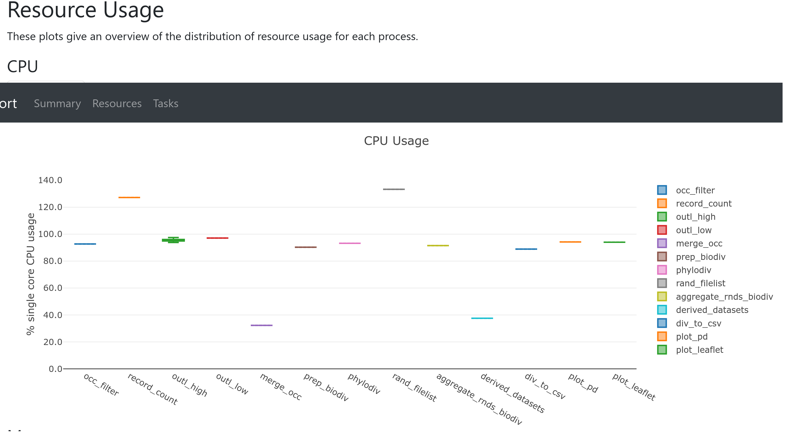

# PhyloNext output

## Diversity estimates in tabular format

Table `03.Plots/Biodiverse_results_merged.txt`

## Interactive map with diversity values

Leaflet-based map `03.Plots/Choropleth.html`

## GeoPackage

Diversity estimates and H3 polygons are also exported into the GeoPackage file (`03.Plots/Diversity_estimates.gpkg`). 
[OGC GeoPackage](https://www.geopackage.org/) is a relatively new, open standard data format for storing geospatial data. 
It is designed to be an efficient, portable, compact, and self-contained format that can store and exchange data within a single file. 

GeoPackage is supported in most modern GIS software packages (e.g., [QGIS](https://www.qgis.org)). 
See the example of opening GeoPackage in QGIS [in the post-processing section](post.md).

!!! info "Why not shapefiles?"
    More information on the comparisons of different formats for storing geospatial data can be found here:  
    [http://switchfromshapefile.org/](http://switchfromshapefile.org/)

## Pipeline summary

In the `results/pipeline_info` directory, there are pipeline execution reports created by Nextflow. 
These files in HTML format includes the workflow report and execution timeline for each process.  

**Workflow report** contains many useful metrics about pipeline execution.  

In particular, the *Resources* section plots the distribution of resource usage (CPU, memory, job duration, and disk I/O) 
for each workflow process using the interactive [plotly.js](https://plot.ly/javascript/) plotting library. 
The plots have several tabs with the raw values and a percentage representation showing what proportion of the requested resources were used. 
These plots are very helpful in checking that task resources are used efficiently.
{ align=left }

The *Tasks* section lists all executed tasks, reporting the status, the actual command script, and many other metrics for each of the tasks. 
The same information is also stored in a tabular format in tab-delimited format (e.g., `execution_trace_*.txt`).
{ align=left }

